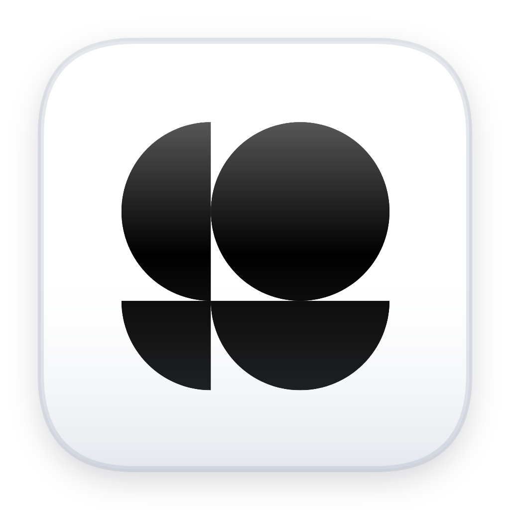

# CapBar

<p align="center">
  
</p>

CapBar is a compact macOS menu bar app for tracking AI coding-agent usage limits at a glance.

<p align="center">
  
</p>

It currently supports Codex and Claude Code. The menu bar item shows the selected provider's current-session and weekly remaining usage, and the popover gives a fuller view with account status, reset times, manual refresh, login actions, provider switching, and lightweight settings.

CapBar is intentionally small: it does not proxy requests, store usage history, or send telemetry. It reads the same local provider state that the CLIs already write on your Mac.

<p align="center">
  
</p>

## Installation

### Option 1: Download The App

This is the easiest option for most users.

1. Open the [latest CapBar release](https://github.com/mattialoszach/capbar/releases/latest).
2. Download `CapBar-macOS.zip`.
3. Double-click the downloaded zip to extract `CapBar.app`.
4. Open Finder and drag `CapBar.app` into the `Applications` folder.
5. Open `Applications`, then open `CapBar`.

CapBar runs in the macOS menu bar and does not appear in the Dock. Look for the CapBar icon near the top-right corner of the screen.

If macOS blocks the first launch, right-click `CapBar.app`, choose `Open`, and confirm. You can also allow it from `System Settings > Privacy & Security` if macOS shows an `Open Anyway` button.

> [!WARNING]
> CapBar is not yet signed with an Apple Developer ID, so macOS Gatekeeper may refuse to open the downloaded app even after the steps above. If you cannot get the release build to launch, use [Option 2: Build And Install From Source](#option-2-build-and-install-from-source) instead, which builds the app locally.

### Set Up A Provider

CapBar reads account and usage information written by the provider CLIs. Install and log in to at least one provider before using CapBar:

```sh
codex login
claude auth login
```

Run each CLI you want to track at least once after logging in. CapBar does not install Codex or Claude Code for you.

### Option 2: Build And Install From Source

Building from source requires:

- macOS 13 or newer
- Git
- Xcode Command Line Tools with Swift 6
- Codex CLI and/or Claude Code CLI for the providers you want to track

Install Apple's command-line tools if needed:

```sh
xcode-select --install
```

Clone and package CapBar:

```sh
git clone https://github.com/mattialoszach/capbar.git
cd capbar
chmod +x scripts/package_app.sh
scripts/package_app.sh
```

The script creates the application here:

```text
dist/CapBar.app
```

Open the build folder in Finder:

```sh
open dist
```

Then drag `CapBar.app` from the `dist` folder into your `Applications` folder. Open CapBar from `Applications` after the copy finishes.

To rebuild an installed copy later, quit CapBar, run the package script again, and replace the existing app in `Applications` with the new `dist/CapBar.app`. The Makefile automates this whole flow (see below).

### Updating From Source With The Makefile

CapBar is not signed with an Apple Developer ID, so it does not ship in-app auto-updates. Instead, a Makefile in the repository root pulls the latest source, rebuilds the app, and installs it into `Applications` for you.

To update an existing source install, run this from the repository:

```sh
make update
```

This will:

1. Run `git pull` to fetch the latest changes.
2. Rebuild the app with `scripts/package_app.sh`.
3. Detect whether `CapBar.app` is already in `Applications`, show the installed and newly built version numbers, and ask before replacing it.
4. Quit the running app, replace the installed copy, and relaunch it.

If you only want to install or reinstall the current build without pulling, use:

```sh
make install
```

Other available targets:

```sh
make build       # build dist/CapBar.app only
make run         # build, then launch from dist without installing
make reinstall   # reinstall the existing dist build without rebuilding
make uninstall   # quit and remove CapBar from Applications
make clean       # remove .build and dist
make help        # list all targets
```

Because the build is ad-hoc signed rather than notarized, macOS may still warn on the first launch after an update. If it does, right-click `CapBar.app`, choose `Open`, and confirm.

### Run Without Installing

For development, launch CapBar directly from the repository:

```sh
swift run CapBar
```

## Features

- macOS menu bar accessory app with no Dock icon.
- Codex and Claude Code provider selector.
- Compact menu bar display with:
  - provider icon
  - current-session and weekly subscription usage by default
  - optional today and month-to-date API spend
- Popover with:
  - account login status
  - current-session usage limit
  - weekly usage limit
  - reset text and reset date where available
  - manual refresh button
  - CLI login button
  - settings panel
  - quit button
- Configurable auto-refresh: manual, 30 seconds, 1 minute, 5 minutes, or 15 minutes.
- Optional provider rotation: off, 5 seconds, 10 seconds, 20 seconds, or 30 seconds.
- Optional low-usage warning colors for remaining limits.
- Optional API console spend tracking per provider (see below).
- Remembers the selected provider, menu bar data mode, rotation interval, refresh interval, and low-usage color preference in `UserDefaults`.
- Local-only credential and session reading.

## API Console Spend (Optional)

Besides subscription limits, CapBar can show your API platform spend for each provider — useful if you also use the Anthropic Console or OpenAI Platform with prepaid credits or monthly billing.

In the popover, the `Anthropic API` / `OpenAI API` panel accepts an API key and then shows what your key is allowed to read:

- **Anthropic**: requires an Admin API key (`sk-ant-admin...`), created in the Claude Console under organization settings. CapBar queries `GET https://api.anthropic.com/v1/organizations/cost_report` and shows month-to-date and today's spend. The Admin API is unavailable for individual accounts — your Console account must belong to an organization, and regular API keys cannot read billing data.
- **OpenAI**: CapBar tries two endpoints with whatever key you provide and shows whichever works:
  - `GET https://api.openai.com/v1/organization/costs` — month-to-date and today's spend. Requires an Admin key (`sk-admin-...`) from `platform.openai.com/settings/organization/admin-keys`.
  - `GET https://api.openai.com/v1/dashboard/billing/credit_grants` — remaining prepaid **credit balance**. This is an undocumented legacy endpoint that accepts some regular user API keys (`sk-...`), but not project keys (`sk-proj-...`). It may stop working at any time.

Anthropic does not expose the remaining credit balance through any API, so for Anthropic CapBar shows spend rather than balance.

### Monthly Limit Bar

When spend data is available, the API panel can draw a limit bar (with the same orange/red low-remaining warning colors as the usage bars) showing month-to-date spend against a monthly limit:

- **OpenAI**: if your key can read the legacy `GET https://api.openai.com/v1/dashboard/billing/subscription` endpoint, CapBar uses the organization's configured monthly hard limit automatically.
- **Anthropic**: the monthly spend limit shown in the Claude Console is not exposed by any API, so set it manually via the panel's `…` menu → `Set Monthly Budget…`.

A manually set budget always takes precedence over the API-provided limit. If only the credit balance is available (OpenAI legacy keys), the bar shows used credits against the total granted instead.

Keys are stored locally in `~/Library/Application Support/CapBar/api-keys.json` with owner-only file permissions — the same approach the provider CLIs use for their own credentials (`~/.claude/.credentials.json`, `~/.codex/auth.json`). CapBar deliberately avoids the macOS Keychain here: the app is not signed with a stable Apple Developer ID, so every rebuild would trigger a new Keychain access prompt. Keys are only ever sent to the respective provider's API. Spend data is cached locally and refreshed at most every 5 minutes. Remove or replace a key at any time via the panel's `…` menu.

## Supported Providers

### Codex

CapBar reads Codex usage from local Codex session files:

```text
~/.codex/sessions/**/*.jsonl
```

It looks for the latest `rate_limits` metadata event and maps:

- `primary` to `Current session`
- `secondary` to `Weekly limit`
- `plan_type` to the source line, such as `Plus plan`

Codex login state is detected from:

```text
~/.codex/auth.json
```

If a stored Codex reset time has already passed and Codex has not written a newer event yet, CapBar treats that window as reset locally instead of showing stale usage.

### Claude Code

CapBar gets Claude Code account identity from:

```sh
claude auth status --json
```

For Claude usage limits, CapBar uses Claude Code OAuth credentials and Anthropic's OAuth usage endpoint:

```text
GET https://api.anthropic.com/api/oauth/usage
```

It checks these local credential sources in order:

```text
~/.claude/.credentials.json
macOS Keychain item: Claude Code-credentials
```

It maps:

- `five_hour` to `Current session`
- `seven_day` to `Weekly limit`
- `extra_usage` is decoded for future use but is not displayed yet

CapBar calls the OAuth usage endpoint at most once every five minutes. It caches the latest successful response locally for up to 24 hours and uses exponential backoff when Anthropic returns HTTP `429`, so a temporary throttle does not replace valid values with `Unavailable`. The cache is stored at:

```text
~/Library/Caches/CapBar/claude-usage.json
```

The cache contains usage values, reset timestamps, and a one-way token fingerprint. It does not contain the OAuth token. Claude usage remains best-effort because Anthropic's OAuth usage endpoint and Claude Code credential locations are not public stable contracts.

## Release Packaging

The same package script used for a source install also creates a zip archive suitable for distribution:

```sh
chmod +x scripts/package_app.sh
scripts/package_app.sh
```

The package script creates:

```text
dist/CapBar.app
dist/CapBar-macOS.zip
```

`dist/CapBar.app` includes the app icon generated from:

```text
docs/images/capbar-icon.png
```

### Optional Code Signing

The package script always signs the app bundle before zipping it. If no signing identity is provided, it uses an ad-hoc signature that is suitable for local testing only. Do not publish an ad-hoc signed zip as a public GitHub Release asset.

If you have an Apple Developer ID certificate, pass it through `CODESIGN_IDENTITY`:

```sh
CODESIGN_IDENTITY="Developer ID Application: Your Name (TEAMID)" scripts/package_app.sh
```

For a public GitHub release, build a Developer ID signed and notarized zip. Use either a notarytool keychain profile:

```sh
CODESIGN_IDENTITY="Developer ID Application: Your Name (TEAMID)" \
NOTARIZE=1 \
NOTARY_KEYCHAIN_PROFILE="notarytool-profile-name" \
scripts/package_app.sh
```

Or use Apple ID credentials:

```sh
CODESIGN_IDENTITY="Developer ID Application: Your Name (TEAMID)" \
NOTARIZE=1 \
APPLE_ID="you@example.com" \
APPLE_TEAM_ID="TEAMID" \
APPLE_APP_SPECIFIC_PASSWORD="xxxx-xxxx-xxxx-xxxx" \
scripts/package_app.sh
```

The notarized build staples the ticket to `dist/CapBar.app`, recreates `dist/CapBar-macOS.zip`, and verifies the result with Gatekeeper before printing the artifact paths.

### Publish A GitHub Release

1. Build the notarized release artifact:

```sh
CODESIGN_IDENTITY="Developer ID Application: Your Name (TEAMID)" \
NOTARIZE=1 \
NOTARY_KEYCHAIN_PROFILE="notarytool-profile-name" \
scripts/package_app.sh
```

2. Create a GitHub Release, for example `v0.2.0`.
3. Upload this file as the downloadable macOS asset:

```text
dist/CapBar-macOS.zip
```

The generated app has `LSUIElement` enabled, so it runs as a menu bar accessory and does not show a Dock icon.

## How To Use

1. Open `CapBar` from the `Applications` folder.
2. Click the CapBar item in the macOS menu bar.
3. Choose `Codex` or `Claude` in the provider selector.
4. Use the refresh button to update immediately.
5. Use the login button to open the provider's CLI login flow in Terminal.
6. Click the gear button to open settings.
7. Choose a provider rotation interval, or leave rotation set to `Off`.
8. Choose an auto-refresh interval, or set auto-refresh to `Manual`.
9. Toggle low-usage colors on or off.
10. Click `X` to fully quit the app.

The selected provider controls what appears in the menu bar. The popover always lets you switch between supported providers.

## What The Menu Bar Shows

The menu bar label is intentionally dense:

- Provider logo on the left.
- A clock row for the current-session window.
- A calendar row for the weekly window.
- Each row includes a small remaining-usage bar and percentage.

If a metric is unavailable, CapBar shows `--%`.

## Settings And Refresh

Provider rotation automatically switches the menu bar display between Codex and Claude. It pauses while the popover is open.

Available rotation intervals:

- `Off`
- `5 sec`
- `10 sec`
- `20 sec`
- `30 sec`

CapBar refreshes automatically based on the selected interval. The default is `1 min`.

Available intervals:

- `Manual`
- `30 sec`
- `1 min`
- `5 min`
- `15 min`

Set auto-refresh to `Manual` to disable the timer.

Manual refresh uses the same refresh path and updates both:

- the menu bar display
- the popover rows

If a refresh is already running, CapBar skips overlapping refresh requests.

Provider reads run off the main actor so the UI does not block while local commands or network calls are running.

Low-usage colors can be toggled from settings. When enabled, remaining usage changes color when a limit is low:

- warning at 30% remaining or less
- danger at 15% remaining or less

## Privacy And Security

CapBar is local-first:

- It does not send telemetry.
- It does not store tokens.
- It does not log full tokens.
- It reads provider credentials only when needed.
- Claude OAuth tokens are kept in memory only long enough to call the usage endpoint.
- Codex usage is read from local session files.

Claude credential reads may access:

```text
~/.claude/.credentials.json
macOS Keychain item: Claude Code-credentials
```

Codex reads may access:

```text
~/.codex/auth.json
~/.codex/sessions
```

## Limitations

- CapBar is not affiliated with OpenAI or Anthropic.
- Claude usage support depends on an undocumented/best-effort OAuth usage endpoint.
- Claude may temporarily return overload or rate-limit errors. CapBar keeps the latest successful values while backing off, provided that cache is no more than 24 hours old.
- Codex usage depends on the latest local `rate_limits` event written by Codex.
- CapBar currently displays two windows per provider: current session and weekly.
- Settings currently cover provider rotation, auto-refresh, and low-usage colors.
- No usage history, charts, or notifications are implemented yet.

## Troubleshooting

### The app does not appear in the Dock

That is expected. CapBar is a menu bar accessory. Look in the macOS menu bar.

### I rebuilt, but the UI did not change

You may still be running the old copy from `Applications`. The simplest fix is to rebuild and reinstall in one step:

```sh
make update
```

Or do it manually by quitting CapBar and rebuilding it:

```sh
pkill -x CapBar
scripts/package_app.sh
open dist
```

In Finder, replace the existing `CapBar.app` in `Applications` with the newly built `dist/CapBar.app`, then reopen CapBar from `Applications`.

### Codex shows no usage

Check that Codex has local session files:

```sh
ls ~/.codex/sessions
```

Then run Codex once so it writes fresh session metadata.

### Codex reset time passed but usage looks stale

CapBar clamps expired local Codex windows to reset locally. If it still looks stale, restart the installed app:

```sh
pkill -x CapBar
open /Applications/CapBar.app
```

### Claude shows logged in but usage unavailable

Confirm Claude Code login:

```sh
claude auth status --json
```

Check whether the Keychain item exists:

```sh
security find-generic-password -s "Claude Code-credentials"
```

If Claude's OAuth usage endpoint is temporarily overloaded or throttled, wait and refresh again.

### The refresh button spins briefly but values do not change

The refresh button only re-reads provider state. If the provider has not written new local Codex metadata, or Anthropic returns an unavailable Claude usage response, values may remain unchanged.

## Project Structure

```text
Sources/CapBar/
  CapBarApp.swift              App entry point and accessory activation policy
  StatusItemController.swift   NSStatusItem and popover wiring
  PopoverView.swift            Main SwiftUI popover UI
  StatusBarLabel.swift         Compact menu bar label
  Models.swift                 Provider and usage models
  UsageStore.swift             Shared settings, refresh state, and auto-refresh timer
  CodexUsageReader.swift       Codex local session reader
  ClaudeUsageReader.swift      Claude CLI/OAuth reader
  ProviderLoginRunner.swift    Terminal login launcher
  ProviderLogoView.swift       Provider logo rendering
  Support.swift                Paths, date parsing, formatting helpers

scripts/
  package_app.sh               Builds dist/CapBar.app

Makefile                       Build, install, and update targets (see Updating From Source)
```

## Logos

Provider logo assets live here:

```text
Sources/CapBar/Resources/Logos/codex.png
Sources/CapBar/Resources/Logos/claude.png
```

If either image is missing, CapBar falls back to an SF Symbol.

## Development Notes

Useful commands:

```sh
swift build
swift run CapBar
scripts/package_app.sh
```

Because this is a menu bar accessory app, use `pkill -x CapBar` when you need to stop the packaged build from the terminal.

## License

CapBar is released under the [MIT License](LICENSE).
