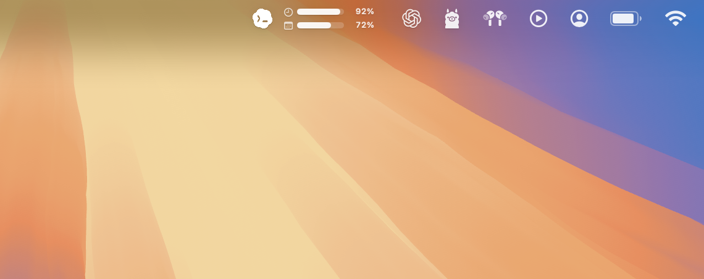
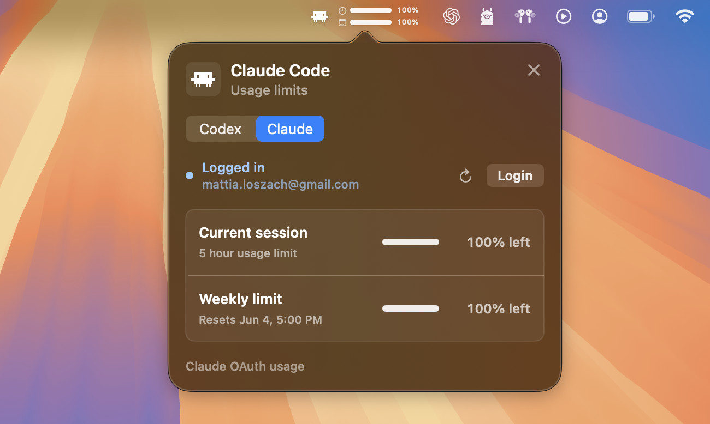

# CapBar

CapBar is a compact macOS menu bar app for tracking AI coding-agent usage limits at a glance.

<p align="center">
  
</p>

It currently supports Codex and Claude Code. The menu bar item shows the selected provider's current-session and weekly remaining usage, and the popover gives a fuller view with account status, reset times, manual refresh, login actions, and provider switching.

CapBar is intentionally small: it does not proxy requests, store usage history, or send telemetry. It reads the same local provider state that the CLIs already write on your Mac.

<p align="center">
  
</p>

## Features

- macOS menu bar accessory app with no Dock icon.
- Codex and Claude Code provider tabs.
- Compact menu bar display with:
  - provider icon
  - current-session remaining percentage
  - weekly remaining percentage
- Popover with:
  - account login status
  - current-session usage limit
  - weekly usage limit
  - reset text and reset date where available
  - manual refresh button
  - CLI login button
  - quit button
- Auto-refresh every 60 seconds.
- Remembers the selected menu bar provider in `UserDefaults`.
- Local-only credential and session reading.

## Supported Providers

### Codex

CapBar reads Codex usage from local Codex session files:

```text
~/.codex/sessions/**/*.jsonl
```

It looks for the latest `rate_limits` metadata event and maps:

- `primary` to `Current session`
- `secondary` to `Weekly limit`
- `plan_type` to the source line, such as `Plus plan`

Codex login state is detected from:

```text
~/.codex/auth.json
```

If a stored Codex reset time has already passed and Codex has not written a newer event yet, CapBar treats that window as reset locally instead of showing stale usage.

### Claude Code

CapBar gets Claude Code account identity from:

```sh
claude auth status --json
```

For Claude usage limits, CapBar uses Claude Code OAuth credentials and Anthropic's OAuth usage endpoint:

```text
GET https://api.anthropic.com/api/oauth/usage
```

It checks these local credential sources in order:

```text
~/.claude/.credentials.json
macOS Keychain item: Claude Code-credentials
```

It maps:

- `five_hour` to `Current session`
- `seven_day` to `Weekly limit`
- `extra_usage` is decoded for future use but is not displayed yet

Claude usage is best-effort. Anthropic's OAuth usage endpoint and Claude Code credential locations are not public stable contracts, so this can break if Claude Code changes its local storage or API behavior.

## Requirements

- macOS 13 or newer.
- Swift 6 toolchain.
- Codex CLI installed if you want Codex usage.
- Claude Code CLI installed if you want Claude usage.

Check the CLIs:

```sh
codex --version
claude --version
```

## Setup

Clone the repo:

```sh
git clone https://github.com/mattialoszach/capbar.git
cd capbar
```

Log in to the providers you want to track:

```sh
codex login
claude auth login
```

Run each CLI at least once after logging in. CapBar depends on local provider state that is written by the CLIs during normal use.

## Run In Development

From the repo root:

```sh
swift run CapBar
```

This launches CapBar directly from Swift Package Manager. It appears in the macOS menu bar, not in the Dock.

## Package As A macOS App

Build a release app bundle:

```sh
chmod +x scripts/package_app.sh
scripts/package_app.sh
```

Open it:

```sh
open dist/CapBar.app
```

Restart after rebuilding:

```sh
pkill -x CapBar
scripts/package_app.sh
open dist/CapBar.app
```

The package script creates:

```text
dist/CapBar.app
```

The generated app has `LSUIElement` enabled, so it runs as a menu bar accessory and does not show a Dock icon.

## How To Use

1. Open `dist/CapBar.app` or run `swift run CapBar`.
2. Click the CapBar item in the macOS menu bar.
3. Choose `Codex` or `Claude` in the segmented control.
4. Use the refresh button to update immediately.
5. Use the login button to open the provider's CLI login flow in Terminal.
6. Click `X` to fully quit the app.

The selected provider controls what appears in the menu bar. The popover always lets you switch between supported providers.

## What The Menu Bar Shows

The menu bar label is intentionally dense:

- Provider logo on the left.
- A clock row for the current-session window.
- A calendar row for the weekly window.
- Each row includes a small remaining-usage bar and percentage.

If a metric is unavailable, CapBar shows `--%`.

## Refresh Behavior

CapBar refreshes automatically every 60 seconds.

Manual refresh uses the same refresh path and updates both:

- the menu bar display
- the popover rows

Provider reads run off the main actor so the UI does not block while local commands or network calls are running.

## Privacy And Security

CapBar is local-first:

- It does not send telemetry.
- It does not store tokens.
- It does not log full tokens.
- It reads provider credentials only when needed.
- Claude OAuth tokens are kept in memory only long enough to call the usage endpoint.
- Codex usage is read from local session files.

Claude credential reads may access:

```text
~/.claude/.credentials.json
macOS Keychain item: Claude Code-credentials
```

Codex reads may access:

```text
~/.codex/auth.json
~/.codex/sessions
```

## Limitations

- CapBar is not affiliated with OpenAI or Anthropic.
- Claude usage support depends on an undocumented/best-effort OAuth usage endpoint.
- Claude may temporarily return overload or rate-limit errors. In that case CapBar shows `OAuth usage unavailable`.
- Codex usage depends on the latest local `rate_limits` event written by Codex.
- CapBar currently displays two windows per provider: current session and weekly.
- No usage history, charts, notifications, or settings screen are implemented yet.

## Troubleshooting

### The app does not appear in the Dock

That is expected. CapBar is a menu bar accessory. Look in the macOS menu bar.

### I rebuilt, but the UI did not change

You may still be running an old packaged app. Restart it:

```sh
pkill -x CapBar
scripts/package_app.sh
open dist/CapBar.app
```

### Codex shows no usage

Check that Codex has local session files:

```sh
ls ~/.codex/sessions
```

Then run Codex once so it writes fresh session metadata.

### Codex reset time passed but usage looks stale

CapBar clamps expired local Codex windows to reset locally. If it still looks stale, restart the packaged app to make sure you are running the latest build:

```sh
pkill -x CapBar
scripts/package_app.sh
open dist/CapBar.app
```

### Claude shows logged in but usage unavailable

Confirm Claude Code login:

```sh
claude auth status --json
```

Check whether the Keychain item exists:

```sh
security find-generic-password -s "Claude Code-credentials"
```

If Claude's OAuth usage endpoint is temporarily overloaded or throttled, wait and refresh again.

### The refresh button spins briefly but values do not change

The refresh button only re-reads provider state. If the provider has not written new local Codex metadata, or Anthropic returns an unavailable Claude usage response, values may remain unchanged.

## Project Structure

```text
Sources/CapBar/
  CapBarApp.swift              App entry point and accessory activation policy
  StatusItemController.swift   NSStatusItem and popover wiring
  PopoverView.swift            Main SwiftUI popover UI
  StatusBarLabel.swift         Compact menu bar label
  Models.swift                 Provider and usage models
  UsageStore.swift             Shared refresh state and auto-refresh timer
  CodexUsageReader.swift       Codex local session reader
  ClaudeUsageReader.swift      Claude CLI/OAuth reader
  ProviderLoginRunner.swift    Terminal login launcher
  ProviderLogoView.swift       Provider logo rendering
  Support.swift                Paths, date parsing, formatting helpers

scripts/
  package_app.sh               Builds dist/CapBar.app
```

## Logos

Provider logo assets live here:

```text
Sources/CapBar/Resources/Logos/codex.png
Sources/CapBar/Resources/Logos/claude.png
```

If either image is missing, CapBar falls back to an SF Symbol.

## Development Notes

Useful commands:

```sh
swift build
swift run CapBar
scripts/package_app.sh
```

Because this is a menu bar accessory app, use `pkill -x CapBar` when you need to stop the packaged build from the terminal.

## License

Add a license before publishing if you want others to reuse or redistribute the code.
